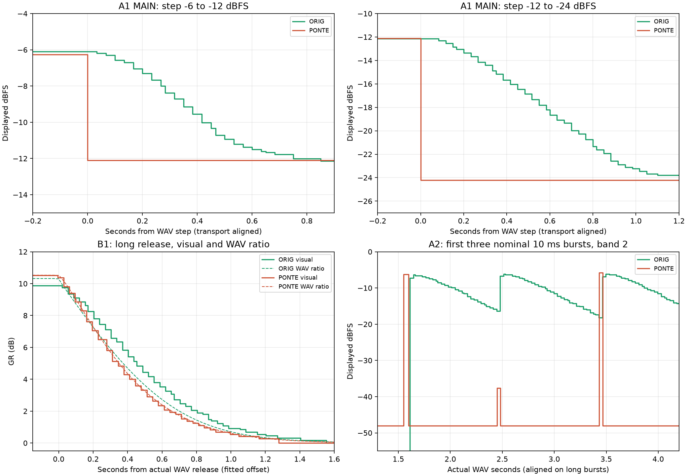

# Analisi dei test GUI 01–05 — 2026-09-15

**Aggiornamento implementazione 0.2.2:** [correzione meter e nota tecnica](../meter_fix_2026-09-15/REPORT.md).
Le misure e gli stati riportati sotto documentano la build precedente.

## Aggiornamento: take 2 e test 04/05

Completato il [secondo giro con grafici e checklist](../analysis_2026-09-15_take2_04_05/REPORT.md).
I take 2 correggono UNLINKED e SOLO 2 nei video; i WAV precedenti sono
stati mantenuti. Metadati ora confermati: **buffer 512**, recorder **OBS**,
audio tramite **export separati**, non stampe della passata video.

- **A2 take 2:** quattro picchi brevi ancora sottorappresentati, due senza
  barra di banda rilevabile; il difetto persiste in UNLINKED.
- **04, banda 3/R250:** GR audio 10.365/10.607 dB originale/Ponte,
  T50 364–369/334–339 ms. GR visiva circa 9.9/10.5 dB e discesa
  90→10% 867–900/750–783 ms: conferma dei risultati della banda 2.
- **05 neutro, confermato dall'utente:** GR zero in entrambi. Differenze
  RMS di uscita circa +0.12/+0.19/+0.18 dB per Ponte a 90/120/180 Hz.
  La prova compressa sulla fondamentale resta da eseguire.

Per la correzione dei meter i dati bastano. Per completare la recensione
mancano **05 compresso R250/R500**, **03/04 R500** e il confronto su voce
dry reale. Parametri completi e condizioni per riusare i B0 nel nuovo rapporto.
Le durate trasformate persistono nei nuovi export; si usano i tempi misurati.
Verifica del secondo giro: 15 401 nuovi fotogrammi, 35 hash invariati fra
registrazioni e sorgenti. POC e CompanyGUI aggiornati.

## Primo giro 01–03: misure e stato al momento della prima analisi

Le voci storiche «buffer/recorder/PRINT ignoti» e «take B0 da correggere»
qui sotto descrivono il primo giro; lo stato corrente è quello riportato sopra.

La differenza di velocità dei meter è confermata dalle registrazioni. MAIN
OUTPUT e il meter di banda dell'originale hanno una discesa graduale; Ponte
passa quasi direttamente al valore del blocco corrente e perde la corretta
rappresentazione di alcuni burst brevi. La differenza della GR è più piccola:
Ponte indica circa 0.6 dB in più sul plateau e torna verso zero più rapidamente.
Questi test sinusoidali non chiudono ancora il caso della voce dell'esperto.



## Materiale e validità dell'acquisizione

- Analizzati **8 MP4 e 8 WAV di uscita**, oltre ai sorgenti del pack. Hash e
  formati sono in `video_inventory.json` e `audio_results.json`.
- Video H.264, 1920 × 1080, 60 fps. I timestamp sono stati letti dal decoder:
  intervalli di circa 16.67 ms; tre file hanno un intervallo finale di 33.33 ms,
  dopo le prove. Nessun buco nei timestamp durante gli eventi misurati. Questo
  controllo non certifica l'assenza di frame duplicati dal recorder.
- **Tutte le tracce AAC dei video sono digitalmente silenziose** dopo decodifica.
  L'allineamento usa il play visibile e gli eventi, non una sincronizzazione A/V.
  Gli offset stimati non sono misure della latenza del plugin.
- WAV IEEE float32 stereo, 48 kHz, L = R, senza clipping. Durate: 01 = 44 s,
  02 = 44 s, 03 = 22 s. Il primo sospetto di semplice troncamento è **superato**:
  02 contiene tutti i 30 burst e 03 tutti e tre gli eventi e le code.
- Nel test 02 gli onset seguono `t_export ≈ 0.780819 × t_source + 0.00111 s`
  (errore massimo 0.83 ms); nel test 03 `≈ 0.857656 × t_source + 0.00175 s`
  (errore massimo 0.08 ms). Gli onset sono misurati con RMS a 1 ms, quindi
  questi residui descrivono il fit, non una precisione fisica sub-millisecondo.
  La portante principale resta a 315 Hz nei segmenti controllati. È coerente
  con una trasformazione temporale che conserva il pitch; la causa precisa,
  incluso l'eventuale Warp di Live, **non è verificata**. Non sono stati usati
  i tempi nominali del manifest per misurare le code esportate.
- Si vede **Ableton Live 11 Intro** e originale **MC2000 MC404 7.3.0.23**.
  Buffer, versione completa di Live, recorder e natura PRINT/offline dei WAV
  restano non documentati. Il template non è compilato. La build Ponte di
  riferimento del pack è `2b6e97e`; il video da solo non certifica l'hash caricato.
- L'utente conferma **LINK MASTER 2 dimenticato nei Ponte A1/A2** e **SOLO 2
  spento nel video Ponte B0**; ritiene che il WAV B0 sia stato fatto in SOLO.
  Nei B1 è visibile SOLO 2; Ponte B1 è UNLINKED. In originale B1 il meter di
  banda segue OUT, come confermano anche i livelli, quindi non è una cattura
  separata dell'IN originale. Con ratio 1:1 IN/OUT sono equivalenti al netto
  dei gain, ma questa acquisizione non prova separatamente entrambi i selettori.

Il WAV Ponte B0 è compatibile con il riferimento filtrato: a 315 Hz il suo
plateau è -6.30942 dBFS peak, contro -6.30942 dell'originale B0 e -6.00000 del
Ponte A1 multibanda neutro. È una forte indicazione a favore del SOLO nel WAV,
**non prova che WAV e video B0 rappresentino la stessa passata**. Le stime dal
rapporto B0/B1 sono riportate con questa riserva. I parametri R1/2:1/250 ms,
attack 2.5 ms, knee 0, BITE 1 e threshold -27.5 dB sono quelli dichiarati nel
protocollo; i valori nascosti dei knob non sono tutti certificabili dal video.

## Test 01: discesa dei meter di livello

Le scale sono state calibrate separatamente. Ponte è lineare in dB da -48 a
0. Nell'originale la posizione è non lineare in dB: sui 14 plateau del MAIN
si ottiene `x ≈ 1.01579 × 10^(dB / 40.24175) - 0.01506`, con x fra 0 e 1
e scarto massimo 0.13 dB rispetto ai plateau del WAV originale. La formula
è una calibrazione empirica nell'intervallo misurato -36…-6 dBFS, non la
formula interna del plugin. Le tacche dei meter di banda sono coerenti con
la stessa scala; per la GR la direzione è invertita. Sotto -36 dB la
quantizzazione cresce: non si interpreta l'estrapolazione come fondo scala.

Tempo fra il 10% e il 90% della discesa **in dB**, misurato all'interno di
ciascun video, quindi indipendente dall'offset A/V:

| Transizione a 315 Hz | Originale MAIN | Originale banda 2 | Ponte MAIN / banda 2 |
| --- | ---: | ---: | ---: |
| -6 → -12 dBFS | 467 ms | 483 ms | stesso frame di salto |
| -12 → -24 dBFS | 717 ms | 750 ms | stesso frame di salto |
| -24 → -36 dBFS | 683 ms | 700 ms | 17 ms |

«Stesso frame» significa tempo non risolto dal video, **non zero millisecondi
fisici**. Considerando anche la seconda portante, Ponte attraversa gli step
in 0–33 ms misurati; l'originale impiega centinaia di millisecondi. La parte
centrale della discesa originale è circa **12–14 dB/s** nell'intervallo
calibrato. Su uno step da 6 dB, attraversare i 4 dB centrali richiede circa
333 ms. Non è la release del compressore: A1 è neutro.

Sono stati confrontati quattro modelli sulle discese a 315 Hz, validandoli
poi su quelle a 2 kHz senza ristimare i parametri:

| Modello di discesa | RMSE su eventi 2 kHz |
| --- | ---: |
| Rampa in dB | 0.24 dB |
| Esponenziale in ampiezza verso il nuovo livello | 0.67 dB |
| Due poli uguali in ampiezza | 0.57 dB |
| Rampa in dB seguita da smoothing | **0.16 dB** |

Il candidato migliore usa circa **14.3 dB/s e smoothing 130 ms**. Il parametro
di offset del fit assorbe host/display/trasporto; non è un hold misurato.
È una descrizione comportamentale promettente, non identificazione univoca
del circuito né un valore già approvato per l'implementazione. La validazione
numerica qui riguarda A1; sui burst A2 è verificata la cattura dei picchi,
non ancora l'errore predittivo di questo modello completo.

## Test 02: cattura dei picchi brevi

Usando i tempi effettivi dei WAV e allineando i video sui burst lunghi:

- **Originale: 30/30 picchi chiaramente visibili**, massimi circa -5.6…-6.7 dBFS
  nei meter delle bande interessate; conservano una coda visibile.
- **Ponte: 4/30 picchi non rappresentati vicino al livello reale**. Il secondo
  burst nominale da 10 ms a 315 Hz arriva solo a circa -37.6 dBFS; il primo
  nominale da 30 ms a 315 Hz a -23.1 dBFS; il primo nominale da 10 ms a 2 kHz
  a -13.6 dBFS; il terzo da 10 ms a 2 kHz non produce una barra rilevabile.
- Gli altri 26 raggiungono un livello vicino a quello atteso. Tre eventi
  restano sotto -20 dBFS sul display; uno di questi è completamente assente.
  Non tutti i quattro casi sono dunque «eventi persi» in senso assoluto.

Le etichette 10/30/100/300/1000 ms identificano i sorgenti. I burst registrati
hanno durate diverse: ad esempio i nominali 10 ms durano circa 11–15 ms sopra
la soglia RMS usata, quelli da 100 ms circa 82–85 ms, quelli da 1 s circa
785–789 ms. Non si deduce una probabilità di perdita universale da tre
ripetizioni, né si attribuisce un ruolo numerico al buffer ancora ignoto.

## Test 03: GR audio e GR mostrata

Il rapporto RMS `20 log10(B0/B1)` usa finestre da 10 ms e lo stesso asse
temporale dei WAV. Gli onset dei due rapporti coincidono alla risoluzione
di 1 ms; i transitori iniziali del crossover sono esclusi dalle misure
di release. T50 e T10 indicano il tempo per arrivare al 50% e al 10% della
**GR in dB**, non del gain lineare. Sono richieste cinque finestre consecutive
sotto soglia per evitare attraversamenti isolati.

| Misura dai WAV | Originale | Ponte |
| --- | ---: | ---: |
| GR sul plateau lungo | 10.319 dB | 10.527 dB |
| T50, tre eventi | 365–369 ms | 335–339 ms |
| T10, tre eventi | 895–905 ms | 849–855 ms |

In questo confronto Ponte attenua circa **0.21 dB in più** e recupera circa
30 ms prima a metà GR e 40–56 ms prima al 10%. Risoluzione della misura
audio circa 10 ms, più l'incertezza del setup B0; non interpretare i tre
decimali come precisione assoluta. La differenza è modesta e ripetibile
fra i tre eventi, non una release dimezzata.

| Misura dai video B1 | Originale | Ponte |
| --- | ---: | ---: |
| GR sul plateau | circa 9.9 dB | circa 10.5 dB |
| Discesa dal 90% al 10% della GR, tre eventi | 867–883 ms | 750–783 ms |

Il divario visivo di plateau è quindi circa **0.6 dB**, superiore al divario
audio di 0.21 dB. Per la lettura originale si considera un'incertezza
orientativa di alcuni decimi di dB (calibrazione trasferita al meter di
banda e quantizzazione); Ponte ha circa 0.14 dB per pixel. Il tempo fra
due soglie video ha un'incertezza di almeno uno/due frame, circa 17–33 ms.

L'originale mostra un ritorno più graduale anche sulla GR. Il grafico
allinea ciascuna curva video al proprio WAV stimando **solo un offset**,
senza riscalare livello o tempo. L'RMSE residuo è circa 0.49 dB originale
e 0.57 dB Ponte, comprendendo gli attacchi non risolti: questo fit non
certifica una costante di smoothing della GR. Il confronto 90%→10%,
indipendente dall'offset, è la misura visiva più robusta qui.

## Perché succede e conseguenze per il progetto

Nel codice corrente `Source/DSP/MultiBandCompressor.cpp`, `process()` azzera
i massimi all'inizio di ogni blocco e `publishMeters()` sovrascrive gli
atomici con IN, OUT e massimo GR di **quel blocco**. In
`Source/PluginEditor.cpp`, `BandMeter::paint()` e il master usano i valori
letti senza una dinamica visiva dedicata; il timer dell'editor è a 30 Hz.
Un impulso può finire ed essere sovrascritto prima della lettura successiva.
Questo spiega la discesa brusca e costituisce una causa concreta, coerente
con i picchi sottorappresentati di A2. Il video non misura da solo quale
blocco audio sia stato letto.

Le priorità implementative ricavate dai dati sono:

1. Conservare i massimi fra letture della GUI con uno scambio sicuro fra
   thread; evitare che la frequenza di repaint determini quali picchi esistano.
2. Aggiungere una dinamica **solo dei meter di livello** indipendente dal
   buffer e dalla velocità della GUI. La rampa smussata stimata è un candidato
   concreto da verificare su A2 e a più buffer; non occorre scegliere la
   velocità alla cieca con un knob permanente.
3. Trattare la GR separatamente: definizione della misura, scala e smoothing
   non si correggono applicando automaticamente la stessa coda di IN/OUT.
   Non sottrarre un offset fisso di 0.6 dB e non allungare la release DSP
   soltanto per far coincidere le barre.
4. Verificare la piccola differenza audio nel setup controllato prima di
   intervenire sul DSP. Il test a 315 Hz/R250 non dimostra il comportamento
   su voce, banda 3 o release 500 ms.

## Prossima acquisizione minima

Non serve scartare queste registrazioni: A1 quantifica già bene la dinamica
visiva. Per chiudere le incertezze:

1. Conservare sorgenti alla durata originale, controllando Warp OFF e la
   fine del clip: 02 **56.35 s**, 03 **25.65 s**. Non basta verificare solo
   la finestra di export: controllare anche i tempi degli eventi nel clip.
2. Ripetere Ponte B0 con SOLO 2 visibile e acceso, UNLINKED, e stampare il
   WAV della stessa passata del video. Poi B1 identico salvo ratio 2:1.
3. Per A2 usare UNLINKED e annotare buffer/sample rate. Dopo la correzione
   dei meter ripetere A2 anche a buffer differenti, mantenendo lo stesso audio.
4. Se possibile catturare l'audio DAW nel video; altrimenti mantenere il
   trasporto visibile come ora. Annotare PRINT/offline e versioni effettive.
5. Secondo giro: R500, file 04 banda 3 e voce dry/file 05, come previsto
   dalla guida. Servono per la conclusione specifica della recensione.

## Riproducibilità e limiti dell'intervento

Nessun WAV/MP4 ricevuto è stato modificato. Nessuna modifica al DSP o alla
GUI del plugin, nessuna nuova build o commit per questa analisi. Aggiornati
POC, nota della recensione e CompanyGUI con i risultati e le riserve.

Gli script sono nel livello superiore. Ordine:

```text
analyze_audio.py
inspect_video.py
extract_meter_traces.py
summarize_traces.py
measure_results.py
check_audio_and_models.py
validate_analysis.py
```

Python 3.12.10 portabile in `build/mc2000-meter-analysis-tools/python`,
NumPy 2.5.3, SciPy 1.18.1, Matplotlib 3.11.2, imageio-ffmpeg 0.6.0;
FFmpeg incorporato 7.1. Dipendenze locali alla cartella build, nessuna
installazione Python di sistema modificata. Impostare `MPLCONFIGDIR` a
`build/mc2000-meter-analysis-tools/mplconfig` prima di eseguire i grafici.
Gli script scrivono solo risultati derivati e si possono rieseguire.

File principali: `measurements.json`, `additional_checks.json`,
`audio_results.json`, `video_inventory.json`, CSV per-frame e GR audio.
`video_overview.png` è un controllo esplorativo con calibrazione preliminare:
per i valori finali usare **meter_comparison.png e measurements.json**.
I log del decoder sono diagnostica riproducibile, non nuovi dati sorgente.

Verifica finale: **PASS**, 21 hash invariati (13 WAV inclusi i cinque sorgenti,
8 MP4), **20 270 fotogrammi** nelle otto tracce, timestamp monotoni, 30 burst
e tre eventi GR per plugin, sintassi di tutti gli script verificata.
Esito salvato in `validation.json`; `git diff --check` senza errori.
Rimossi ZIP del runtime Python e bootstrap pip dopo l'estrazione, liberando
circa 12.3 MiB; conservati runtime locale, risultati e registrazioni originali.
Le versioni delle dipendenze sono fissate in `../requirements-analysis.txt`.
