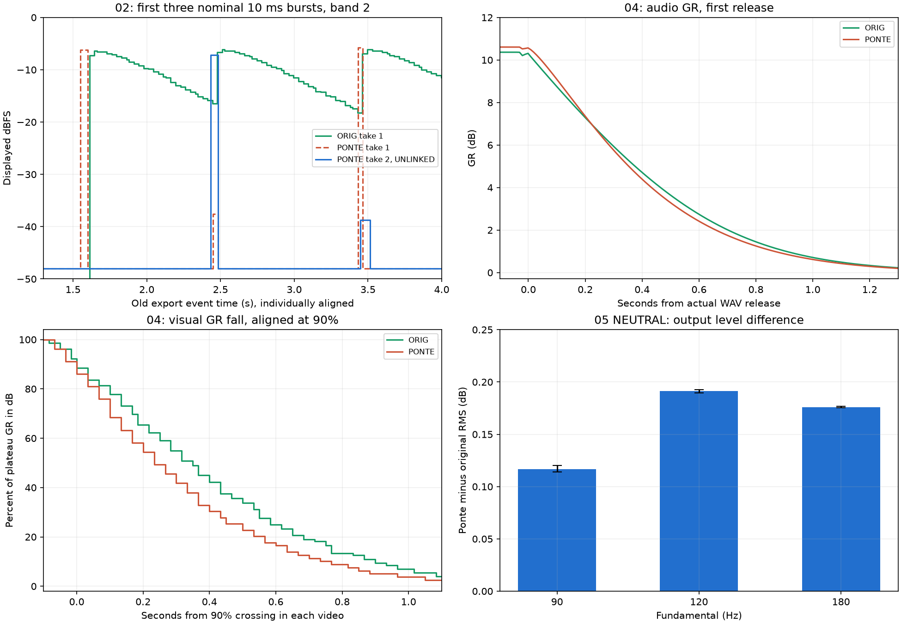

# Secondo giro: take 2, banda 3 e sonda neutra — 2026-09-15

**Aggiornamento implementazione 0.2.2:** [correzione meter e nota tecnica](../meter_fix_2026-09-15/REPORT.md).
Le misure e gli stati riportati sotto documentano la build precedente.

**I take 2 confermano il problema dei meter anche dopo la correzione del
setup. Il test 04 conferma sulla banda 3 le piccole differenze audio già
misurate sulla banda 2. Il test 05 è un riferimento neutro valido; la
prova con compressione attiva resta da eseguire.**



Questa analisi integra il [primo rapporto](../analysis_2026-09-15/REPORT.md).
Non sostituisce le registrazioni precedenti né attribuisce i vecchi WAV
ai nuovi video take 2.

## Acquisizioni e metadati completati

Ricevuti **8 nuovi video e 6 nuovi WAV**:

| Materiale | Stato |
| --- | --- |
| 02 Ponte A2 take 2 | UNLINKED visibile; nessuna GR rilevata sulle bande 2/3 |
| 03 Ponte B0 take 2 | UNLINKED, SOLO 2 acceso, GR zero |
| 04 originale/Ponte B0/B1 | Quattro video e quattro export; SOLO 3, R250 dichiarato nei nomi |
| 05 originale/Ponte BAND23 | Due video e due export; **neutro**, confermato dall'utente |

L'utente ha chiarito: **buffer 512 campioni**, recorder **OBS**, WAV prodotti
tramite **export separati**, non PRINT della stessa passata video; i WAV
02/03 precedenti sono stati mantenuti. I rispettivi hash lo confermano.
Questi dati completano le voci che nel primo rapporto erano sconosciute.

I nuovi video sono 1920×1080, 60 fps, con tracce AAC digitalmente silenziose.
I WAV sono stereo float32 a 48 kHz, L = R, senza clipping. Live 11 Intro e
MC404 7.3.0.23 sono visibili. Buffer di playback dichiarato: a 48 kHz,
512 campioni corrispondono a 10.67 ms. Questo **non certifica** la dimensione
dei blocchi usata dall'export offline. Versioni complete di Live/OBS,
driver e hash del binario Ponte caricato restano non verificati.

I video sono utili per misurare forme, picchi e intervalli interni alla
GUI; gli export per confrontare l'audio. Non si può misurare una latenza
A/V assoluta o sostenere che un campione del WAV sia lo stesso elaborato
in quel fotogramma. L'assenza dell'audio OBS non impedisce questi confronti.

## 02 take 2: il difetto persiste in UNLINKED

I 30 eventi sono stati associati al vecchio export tramite la sequenza
temporale completa, poi verificati sui sei burst lunghi. La dispersione
degli offset sui sei onset è circa **30 ms**, entro la risoluzione di uno/due
frame. È stato necessario un offset di circa 1.72 s rispetto al play
rilevato: è un parametro di allineamento della cattura, **non latenza DSP**.

Anche nel take 2 **4 picchi su 30** restano sotto -9 dBFS nei meter delle
bande interessate, a fronte di burst nominali a -6 dBFS:

| Evento | Sorgente nominale | Picco visivo Ponte take 2 |
| --- | --- | ---: |
| 1 | 315 Hz, primo burst 10 ms | Nessuna barra di banda rilevabile |
| 3 | 315 Hz, terzo burst 10 ms | -38.7 dBFS |
| 16 | 2 kHz, primo burst 10 ms | -28.5 dBFS |
| 17 | 2 kHz, secondo burst 10 ms | Nessuna barra di banda rilevabile |

Gli altri 26 raggiungono circa -5.7…-7.2 dBFS. «Nessuna barra» riguarda
il meter della banda: non significa assenza del segnale audio o necessariamente
assenza di ogni traccia sul master. Il fondo grafico Ponte è -48 dBFS.
Le etichette 10 ms identificano il sorgente: non sono misure della durata
effettiva dei burst trasformati nella DAW.

Il take 1 aveva anch'esso quattro picchi sottorappresentati, ma non tutti
gli stessi eventi. Con il take 2 corretto il difetto non scompare, quindi
**MASTER 2 non è una condizione necessaria per produrlo**. Il risultato è
coerente con massimi sovrascritti tra aggiornamenti GUI, come risulta dal
codice. Due passate non stimano una probabilità generale di perdita né
isolano l'effetto del buffer da tutte le altre variabili.

## 03 B0 take 2: riferimento visivo corretto

SOLO 2 e UNLINKED sono ora visibili. GR resta a zero; IN e OUT di banda
coincidono entro **un pixel, circa 0.14 dB**, nella parte utile della passata.
Il plateau è circa -6.2 dBFS sul meter, compatibile con il riferimento
filtrato precedente tenendo conto della quantizzazione grafica.

Questo chiude l'errore di configurazione del video B0. I WAV sono gli
export precedenti: le misure audio del test 03 **restano le stesse**, non
sono una nuova replica del DSP e non diventano stampe sincronizzate al take 2.

## 04: banda 3 a 2 kHz, R1/R250

La coppia B0/B1 è disponibile per entrambi i plugin. Rapporto RMS delle
uscite ratio 1:1 e 2:1 su finestre da 10 ms; tempi ricavati dagli eventi
effettivi del riferimento neutro. Le prime finestre dopo lo step sono
escluse. T50/T10 riguardano la **GR in dB**, non il guadagno lineare.

| Misura audio | Originale | Ponte |
| --- | ---: | ---: |
| GR sul plateau lungo | 10.365 dB | 10.607 dB |
| T50, tre eventi | 364–369 ms | 334–339 ms |
| T10, tre eventi | 899–905 ms | 849–855 ms |

Ponte applica circa **0.24 dB in più** e arriva a metà GR circa **30 ms prima**;
al 10% la differenza è circa **50 ms**. La risoluzione temporale audio è
circa 10 ms, non quella suggerita dai decimali del JSON.

Il risultato ripete il comportamento del test 03/banda 2, dove il divario
di plateau era circa 0.21 dB e quello di T50 circa 30 ms. L'ipotesi che
questa piccola differenza fosse limitata alla banda 2 non è sostenuta.
Non si osserva una release dimezzata.

| Misura visiva GR | Originale | Ponte |
| --- | ---: | ---: |
| Plateau/picco stabile | circa 9.9 dB | circa 10.5 dB |
| Discesa dal 90% al 10%, tre eventi | 867–900 ms | 750–783 ms |

La scala originale è calibrata come nel primo giro e trasferita allo
stesso meter di banda. Le nuove posizioni delle finestre e la diversa
larghezza Ponte sono state misurate separatamente. Le letture assolute
hanno un'incertezza di alcuni decimi di dB; gli intervalli visivi almeno
17–33 ms. Il grafico normalizza la GR e allinea le curve al passaggio del
90%, per confrontare la forma senza fingere una sincronizzazione A/V.

Anche qui la differenza visiva di plateau, circa 0.6–0.7 dB, supera quella
audio. Il display originale ha un ritorno più graduale. Non basta tuttavia
questa misura per attribuire una costante di smoothing esatta alla GR o
per giustificare una compensazione fissa in dB.

## 05 neutro: cosa misura e cosa resta aperto

L'utente conferma l'esecuzione in neutro. Entrambi i video mostrano IN 2/3,
nessun SOLO, curve statiche lineari e **GR zero** sulle bande 2/3 durante
la parte utile. Quindi questo test non può ancora dire quanta compressione
serva sulla fondamentale dominante.

Il riferimento è comunque utile per la catena multibanda neutra. Le dodici
frasi sono presenti; il confronto RMS integrato esclude i primi 80 ms e
gli ultimi 25 ms di ciascuna frase, riducendo l'errore dovuto a finestre
troppo corte rispetto ai periodi delle basse frequenze:

| Fondamentale | Livello Ponte meno originale, quattro frasi |
| --- | ---: |
| 90 Hz | +0.114…+0.120 dB |
| 120 Hz | +0.190…+0.192 dB |
| 180 Hz | +0.175…+0.177 dB |

Sono differenze di livello dell'**uscita sommata neutra**, compatibili con
differenze della catena/crossover; non sono GR di una banda né una misura
della somiglianza timbrica completa. Le frequenze principali 90/120/180 Hz
sono state verificate negli export. La sonda resta sintetica, non una voce reale.

## Tempi dei file: la trasformazione resta presente

I nuovi export 04 e 05 durano entrambi **22 s**, rispetto ai sorgenti
25.65 e 26 s. Non mancano semplicemente gli ultimi secondi:

- 04 contiene tre eventi completi, onset a circa 4.289, 12.008 e 15.568 s;
  fattore temporale degli onset **0.857710**, residuo massimo del fit 0.30 ms
  sulla griglia di misura a 1 ms. La portante resta a 2 kHz.
- 05 contiene le dodici frasi e le tre fondamentali; fattore degli onset
  circa **0.84607**, residuo massimo circa 3 ms. Questo fattore descrive gli
  onset, non una riscalatura uniforme verificata di ogni tratto della forma d'onda.
- 02/03 mantengono i WAV precedenti e quindi i fattori già misurati. Il
  take 2 A2 è compatibile temporalmente con la sequenza dell'export precedente.

La causa precisa non è stata identificata. La misura delle code usa i
tempi realmente presenti, evitando di confondere lo spostamento degli
eventi con un errore nella release. Per i prossimi test usare clip alla
durata originale e verificare Warp OFF; se si cambia la timeline, anche
i riferimenti B0 devono avere la nuova timeline.

## Che cosa manca, in ordine di utilità

**Per iniziare a correggere i meter i dati sono sufficienti:** conservazione
dei massimi tra letture e dinamica visiva separata dal DSP. Il candidato
14.3 dB/s + smoothing 130 ms del primo giro resta da validare come modello
completo sui burst; non è ancora implementato.

Per completare la verifica della recensione servono:

1. **Test 05 compresso, originale e Ponte**, R1, release 250 ms e poi 500 ms,
   con i parametri espliciti nella guida sotto. Conservare il neutro come
   riferimento, ripetendolo se cambia la timeline. La somma multibanda
   consente il confronto dell'uscita, non il calcolo diretto della GR per banda.
2. **Test 03 e 04 con release 500 ms**, originale e Ponte, rispettivamente
   SOLO 2 e SOLO 3. B0 non va ripetuto solo perché cambia la release, purché
   ratio 1:1, routing, gain e timeline siano gli stessi. Serve per verificare
   il tempo citato inizialmente dall'esperto, oltre al setup preciso R250.
3. **Una voce dry reale** per chiudere il caso percettivo: utile quella
   dell'esempio dell'esperto. Il test sintetico isola la fondamentale ma
   non sostituisce la voce.

Dopo la modifica dei meter: A2 a buffer 512 e almeno un buffer diverso,
ad esempio 64/1024 se disponibili, con più ripetizioni dei burst brevi.
È una validazione successiva, non una nuova acquisizione preliminare
necessaria per stabilire che il difetto esiste. Una cattura OUT originale
distinta da IN è utile per certificare entrambi i selettori; non blocca
la correzione del meter di livello già documentata.

### Parametri completi del test 05 compresso

| Impostazione | Valore |
| --- | --- |
| Modello / crossover | 4 bande / 100, 785, 10000 Hz |
| IN / SOLO | IN 2 e 3; IN 1 e 4 spenti; **nessun SOLO** |
| LINK / sidechain esterno / fase | UNLINKED / spento / normale |
| Input, output e gain delle quattro bande | Tutti 0 dB |
| Bande 2 e 3: algoritmo | R1 |
| Bande 2 e 3: ratio / threshold | **2:1 / -27.5 dB** |
| Bande 2 e 3: knee / BITE | **0 / 1** |
| Bande 2 e 3: attack | **2.5 ms** |
| Bande 2 e 3: release | Prima **250 ms**, poi **500 ms** |
| Bande 1 e 4 | Ratio 1:1, IN spento, gain 0 dB |
| Buffer / export | 512 campioni; WAV stereo 48 kHz float32, normalizzazione OFF |

Per B0 mantenere esattamente la stessa configurazione e porre ratio **1:1**
anche sulle bande 2 e 3. Un video e un export per plugin/passata, nomi ad
esempio `05_ORIG_BAND23_R1_RATIO21_R250` e `05_PONTE_BAND23_R1_RATIO21_R500`.
Annotare gli export come separati dalla cattura, come in questo giro.

## Riproducibilità e verifica

Gli script nel livello superiore sono, in ordine:

```text
analyze_followup.py
extract_followup_traces.py
analyze_followup_audio.py
measure_followup_video.py
validate_followup.py
```

Usano il runtime portabile e `requirements-analysis.txt` già predisposti.
Risultati separati dal primo giro: `inventory.json`, `trace_inventory.json`,
`audio_measurements.json`, `video_measurements.json`, CSV, fotogrammi nativi
e grafici. `CAPTURE_CONFIRMED.json` distingue dichiarazioni dell'utente,
osservazioni e metadati ancora ignoti.

Verifica finale **PASS**: 35 hash invariati (19 WAV inclusi i sorgenti,
16 video di entrambi i giri), **15 401 nuovi fotogrammi**, timestamp monotoni,
30 eventi A2, tre code GR per plugin, zero GR nel 05 neutro, portanti verificate,
sintassi degli script valida. Totale dei due giri: **35 671 fotogrammi**.
Gli eventuali intervalli finali più lunghi sono elencati nel trace inventory;
non si confonde questo controllo con la rilevazione di tutti i frame duplicati
dal recorder. Esito in `validation.json`.

Aggiornati rapporto principale, guida, nota della recensione, POC e CompanyGUI.
Nessuna modifica al DSP/GUI del plugin, nessuna nuova build o commit per
questa task di analisi. WAV e video ricevuti sono stati conservati invariati.
