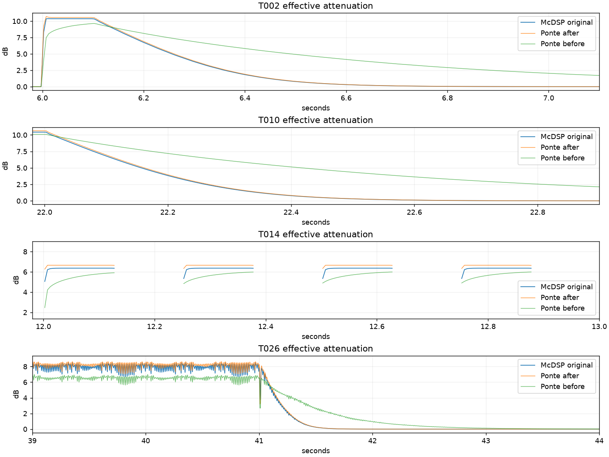

# Analisi render originali e correzione Auto — 19 settembre 2026

Build di prova **0.2.3**, modello DSP **6**. Baseline codice:
`2dc55d361bd803537aa4feaf186173887c6f439b` (prima della correzione Auto).
Questa revisione modifica intenzionalmente il suono di Auto. R1, R2, BITE,
crossover, IN/SOLO e dinamica grafica non vengono ricalibrati.

## Acquisizione ricevuta

Inventariati **47 WAV stereo float32 a 48 kHz**; hash e caratteristiche in
[inventory.json](inventory.json). Le 22 sorgenti corrispondono al manifest.
46 export hanno esattamente 2.880.000 frame (60 s); T057 ha 251 frame in piu.
I nomi brevi `T001.wav` e i nomi annotati sono associati agli ID del piano,
senza rinominare, riscrivere o normalizzare gli originali.

- T001–T037, T046–T048 sono udibili: **40 file**, non 40 condizioni confermate.
- **T055–T061 sono interamente zero**, su entrambi i canali. La sorgente 13
  contiene audio: questi export non verificano l'automazione.
- **T023 e T021 sono identici campione per campione**, ma richiedono sorgenti
  diverse (rumore contro multitono). T024 rimane sospeso finche manca il suo B0.
- T027/T028 e T029/T030 si annullano a circa −151 dB relativi: i due valori
  BITE previsti non producono una differenza misurabile in questi file.
- T035/T036/T037 sono identici; coincidono praticamente con T027, non T002.
  T002/T037 hanno errore relativo −36,67 dB, concentrato soprattutto negli
  attacchi. Possibile impostazione conservata o risposta del controllo: i WAV
  da soli non permettono di scegliere la spiegazione. Non usare queste righe
  per ricalibrare BITE o dichiarare verificata la ripetizione da istanza nuova.
- T046–T048 permettono controlli stereo; T047 non entra nel fit quantitativo
  Auto finche le impostazioni BITE della serie successiva non sono confermate.

Non ricevuti T038–T045, T049–T054, T062–T088: **41 righe del piano**.
L'utente ha segnalato di non avere potuto eseguire la sidechain; non e un test
fallito del plugin. T053/T054 sono i controlli a detector interno del gruppo.
Mancano anche versioni/session metadata per certificare tutte le impostazioni.
I parametri dei confronti seguenti sono quelli prescritti dal piano: non e
possibile recuperarli integralmente dai WAV.

Il validatore deve segnalare FAIL su questa consegna, per sette export muti
(T057 anche fuori durata) e un duplicato fra sorgenti diverse. Il FAIL indica
problemi dell'acquisizione, non un fallimento dei test automatici del DSP.

## Metodo e risultati

Renderer C++ del motore di produzione, stereo, 48 kHz, blocchi 512, tutti i
parametri letti da `render_plan.json`; stessa sorgente PCM24, nessun cambio
di tempo, normalizzazione o allineamento ottimizzato per minimizzare l'errore.
30 condizioni confrontabili: 10 B0, 7 R1/R2, 13 Auto. Le altre sono escluse
esplicitamente in `analyse.py`, non corrette implicitamente per farle aderire.

Per ogni motore si divide l'RMS dell'uscita compressa per **il suo** neutro
equivalente in finestre di 5 ms. Si escludono finestre con B0 sotto −65 dBFS
in uno dei motori. Nel mix multibanda questa e attenuazione effettiva di uscita,
non la GR interna di una singola banda e non il valore visualizzato dal meter.
Il rapporto evita di attribuire automaticamente alla compressione una diversa
fase dei crossover. Non costituisce una misura di null dell'audio complessivo.

MAE in dB sulle finestre valide, inclusi i tratti udibili non compressi:

| Test | Condizione | Prima | Nuovo Auto |
|---|---|---:|---:|
| T002 | step 315 Hz, banda 2 | 0,458 | 0,056 |
| T006 | impulsi e memoria, banda 2 | 0,763 | 0,024 |
| T010 | step 2 kHz, banda 3 | 0,460 | 0,060 |
| T014 | crest variabile, RMS costante | 0,422 | 0,321 |
| T016 | crest variabile, picco costante | 0,625 | 0,244 |
| T018 | step 50 Hz, banda 1 | 0,455 | 0,033 |
| T020 | step 14 kHz, banda 4 | 0,441 | 0,057 |
| T022 | multitono, tutte le bande | 0,141 | 0,092 |
| T026 | frase armonica indipendente | 0,514 | 0,099 |
| T031 | ratio 4:1 | 0,687 | 0,085 |
| T032 | threshold −18 dB | 0,237 | 0,033 |
| T033 | knee −5 | 0,465 | 0,055 |
| T034 | knee +10 | 0,475 | 0,172 |

Le metriche includono anche RMSE, p95 e una selezione separata delle finestre
con attenuazione >0,1 dB in almeno uno dei modelli: non confondere la media
dell'intera prova con l'errore durante un attacco. Nei test crest rimane uno
scarto stazionario di circa 0,2–0,3 dB. Il p95 di T034 e circa 0,71 dB.
T026 non viene usato per ricavare i coefficienti: e una verifica indipendente,
ma resta un segnale sintetico, non una registrazione di voce reale.

Nei B0 la differenza RMS a finestre corte arriva a circa 1,06 dB sul tono
50 Hz e 0,24–0,25 dB sui mix: fase e finestratura hanno peso. Questi valori
restano documentati e non vengono cancellati tramite compensazioni di gain.
R1/R2 mostrano MAE di circa 0,068–0,145 dB: non emergono motivi sufficienti
per cambiare le leggi manuali durante questa correzione Auto.



Dati completi: [prima](comparison_before.json), [dopo](comparison_after.json).
La selezione "active" usa originale oppure il Ponte della singola revisione
sopra 0,1 dB: le sue finestre possono differire fra revisioni. La tabella
principale usa le stesse finestre valide e rimane il confronto diretto.

## Modello matematico e implementazione

Dagli step originali si ricava la GR con un guadagno scalare ai minimi quadrati
fra uscita e B0 in finestre di 1 ms. Si adatta il tratto da 25 a 900 ms dopo
la caduta, finche la GR supera 0,03 dB. Il modello osservato e:

`g(t) = 20 s log10(1 + A exp(−t / tau))`, con `s = 1 − 1/ratio`.

Nei test a knee 0 e −5, su livelli, bande, ratio e threshold diversi,
`tau` e circa **101,94–102,04 ms**. L'RMSE del fit e circa 0,0006–0,0047 dB.
I risultati completi sono in [original_metrics.json](original_metrics.json).
Il knee +10 non segue altrettanto bene lo stesso modello: il fit descrittivo
da circa 71–74 ms. Non si introduce un coefficiente speciale per un solo knee.

Si sostituisce il fallback crest factor con un controllo di picco nel dominio
lineare: `q_target = 10^(target_GR / (20 s))`. In salita il controllo segue
il target con tau **20 microsecondi**; in discesa l'eccesso `q−1` decade con
tau **102 ms**. La GR e `20 s log10(q)`. La cattura rapida e una scelta
implementativa verificata sui render, non una misura di un parametro nascosto.
La release in dB cambia con la profondita iniziale pur avendo tau lineare fissa.
Ratio 1:1 e neutro; cambio ratio/modalita preserva l'inviluppo dove applicabile;
reset cancella lo stato; il dominio e limitato per evitare overflow vicino a 1:1.

Il modello ignora Attack/Release manuali, coerentemente con l'audit storico;
le coppie T035/T036 lo supportano per le impostazioni effettivamente mantenute,
ma non risolvono l'incoerenza con T002. Non e una ricostruzione del codice
McDSP, ne identifica un circuito analogico o le intenzioni dei suoi autori.

DSP_MODEL_6 identifica il cambio sonoro Auto. Versione pubblica **0.2.3**,
schema parametri invariato. I preset Auto precedenti possono suonare diversi.
La notifica release, l'help, la GUI e i meter conservano le regole gia presenti.
La precedente equivalenza audio 54/54 della sola ottimizzazione resta un dato
storico: non vale per questa revisione intenzionale di Auto.

## Cosa rifare o completare

Priorita, senza richiedere nuovamente tutto il pacchetto:

1. **T023** con sorgente `09_NOISE_HOLDOUT`, ratio 1:1, tutte le bande, per
   poter valutare T024 gia consegnato. Controllare anche la sorgente di T024.
2. **T055/T056**, prima di registrare altre automazioni: sorgente
   `13_AUTOMATION_315`, IN delle quattro bande accesi, SOLO 2, UNLINKED,
   crossover 100/785/10000, gain 0; verificare che l'export contenga audio.
   B0 R1 ratio 1:1; Auto ratio 2:1, threshold −27,5, knee 0, BITE 1,
   Attack 2,5, Release 250 sulle quattro bande. Durata esatta 60 s, Warp OFF.
3. **T057–T061** con audio e la timeline della tabella, oppure fornendo una
   timeline precisa dei movimenti effettivi. I nomi indicano rampe e X2,
   mentre il piano richiede gradini e X1: non sono protocolli intercambiabili.
4. **T002/T027/T028/T035/T036/T037**, dopo verifica delle impostazioni:
   acquisire da preset comune con BITE 1 ripristinato, quindi solo BITE 5/10
   sulla banda 2 per T027/T028. Analoga verifica T010/T029/T030 sulla banda 3.
   Non occorre rifarli se screenshot/preset e chiarimento spiegano le differenze.
5. Per chiudere la validazione generale: altri modelli T038–T045, sample rate
   nativi T062–T081, prove esperto R1/500 ms T082–T086, meter T087/T088 e voce
   reale. La sidechain T049–T054 resta esplicitamente non acquisita.

## Riproduzione

Da root del progetto, usando un Python con NumPy/SciPy/Matplotlib:

```powershell
python products/MC2000/Research/NEXT_RELEASE_ORIGINAL_TEST_PACK/validate.py
python products/MC2000/Research/NEXT_RELEASE_ORIGINAL_TEST_PACK/analyse.py --audit --prepare build/mc2000-auto-2026-09-19 --label after
cmake --build build/MC2000-analysis-vs --config Release --target MC2000OriginalPackRender
build/MC2000-analysis-vs/Release/MC2000OriginalPackRender.exe build/mc2000-auto-2026-09-19/jobs_after.txt
python products/MC2000/Research/NEXT_RELEASE_ORIGINAL_TEST_PACK/analyse.py --measure build/mc2000-auto-2026-09-19 --label after
ctest --test-dir build/MC2000-analysis-vs -C Release --output-on-failure
python products/MC2000/Research/NEXT_RELEASE_ORIGINAL_TEST_PACK/verify_results.py build/mc2000-auto-2026-09-19 --build build/MC2000-analysis-vs
```

Per `before` compilare il renderer contro il DSP del commit baseline indicato
all'inizio. Gli intermedi float32 restano sotto `build/`, fuori dal repository;
WAV originali e sorgenti rimangono intatti e non vengono pubblicati su GitHub.
Esiti finali di build/regressione e hash sono registrati in `verification.json`.

Verifica finale: **13/13** confronti Auto migliorati, **17/17** output neutri
e manuali bit-identici alla baseline. Build Windows x64 VST3 0.2.3 riuscita;
CTest **2/2 PASS** (DSP 4,65 s, GUI 6,24 s). Test aggiunti per ancore misurate
del rilascio, ratio 2/4, indipendenza dai tempi manuali, reset, transizioni,
limiti numerici e blocchi regolari/irregolari. Nessuna release pubblicata.
