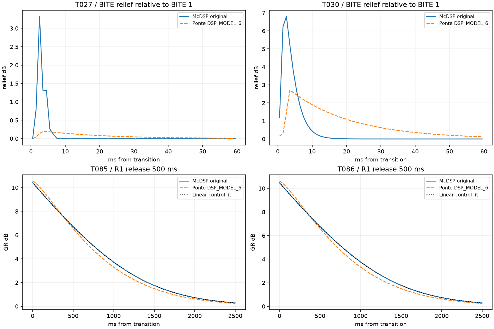
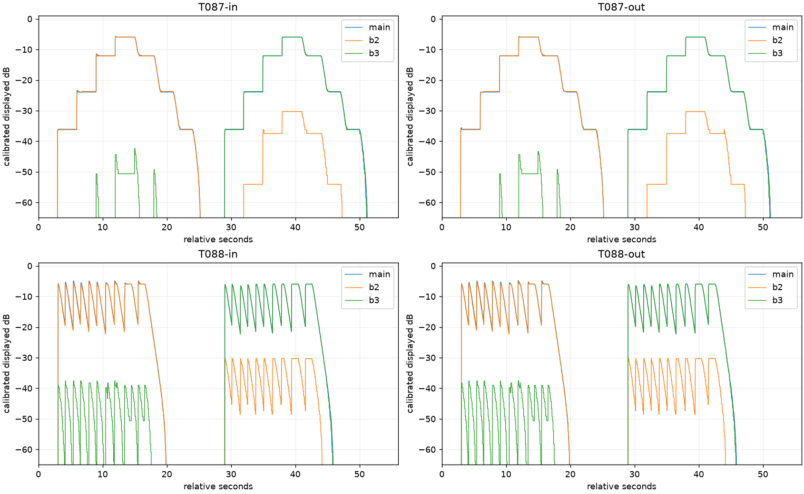

# Nuova consegna originale — analisi del 20 settembre 2026

**Risultato:** le nuove sonde mostrano due differenze audio concrete da affrontare:
la forma del rilascio R1 e l'intensità/durata del transiente BITE. Auto con BITE 1
trova ulteriori conferme. I video permettono di affinare le misure IN/OUT, ma
non verificano il meter GR né la latenza assoluta audio→schermo.

Questa è un'analisi: **nessuna modifica al DSP o alla GUI, nessuna nuova build**.
Riferimento Ponte congelato: **0.2.3, DSP_MODEL_6**, commit
`5d8bd92709b113a7957db591a609ef3044dd350e`. Il rapporto del
[19 settembre](../analysis_2026-09-19/REPORT.md) resta lo storico della prima
consegna e della correzione Auto; le esclusioni attuali sono quelle qui sotto.

## 1. Consegna e validità

Inventariati **80 WAV, corrispondenti a 75 ID del piano**, e quattro video.
Cinque WAV con nomi annotati sono vecchie acquisizioni conservate: per il
confronto si seleziona il nuovo nome esatto `Txxx.wav`. Nessun originale è
stato rinominato, normalizzato o cancellato. Hash e formato in
[inventory.json](inventory.json); selezione in [selection.json](selection.json).

| Gruppo | Stato attuale |
| --- | --- |
| T001–T022, T025–T034, T046–T048 | Disponibili; BITE 5/10 ora distinguibili. Le precedenti cautele su ripetizioni/configurazione non diventano automaticamente PASS. |
| T023/T024 | Entrambi completamente muti: rumore non valutabile. |
| T035–T037 | Nuovi file completamente muti: indipendenza dai tempi manuali/ripetizione non verificabile con questa consegna. |
| T038–T045 | Disponibili; MC202 isolato utile, incongruenze MC202 ALL e MC303 isolato descritte sotto. |
| T049–T054 | Assenti: sidechain non acquisita, compresi i controlli interni T053/T054. Non è un fallimento del DSP. |
| T055–T061 | Tutti muti; T058 dura anche **56 s**. Automazione non verificabile. |
| T062–T074 | Presenti a 44,1/48/88,2/96 kHz secondo il piano; condizioni ALL non equivalenti fra alcune acquisizioni. |
| T075–T081 | Ancora attesi, come anticipato dall'utente: completamento 96 kHz e gruppo 192 kHz. |
| T082–T086 | Disponibili: sonde armoniche e R1 500 ms utilizzabili. |
| T087/T088 e quattro video | WAV a **96 kHz**, piano a 48 kHz. Video utilizzabili per dinamica relativa; frequenza effettiva del motore DAW non confermata. |

**Dodici file primari hanno ogni campione a zero su entrambi i canali**:
T023, T024, T035, T036, T037, T055, T056, T057, T058, T059, T060, T061.
L'utente conferma di averli rifatti e non conosce il motivo del silenzio.
La verifica successiva alla risposta trova gli stessi hash e lo stesso silenzio
nella cartella attuale. Anche i neutri sono muti, mentre le sorgenti contengono
audio: non si può attribuire questo risultato al compressore Auto. Dal solo
WAV non si identifica il punto del routing/export in cui sparisce l'audio.

## 2. Metodo e riproducibilità

Eseguiti confronti su **61 condizioni udibili con formato compatibile**: questo
numero include condizioni sospette usate come diagnostica, non 61 test superati.
Il motore completo usa sorgenti del manifest, parametri del piano e blocchi
512. **30 output** precedenti sono riutilizzati dopo verifica degli hash di
sorgenti DSP, renderer e output; **31 output** sono nuovi.
[Provenienza](engine_provenance.json), [hash output](engine_output_hashes.json),
[tutti i risultati numerici](comparison.json).

Per ogni plugin si divide il livello compresso per il proprio riferimento
neutro filtrato B0. Le metriche generali sono in finestre RMS di **10 ms**,
escludendo B0 sotto −65 dB in uno dei due motori. È salvata anche la metrica
limitata a intervalli con attenuazione originale >0,1 dB. Sull'uscita sommata
si parla di attenuazione effettiva, non del GR di una singola banda. Nessuno
spostamento temporale o adattamento del DSP alle nuove acquisizioni.

Per BITE si usano finestre RMS di **1 ms** e primi 50 ms degli attacchi a
6/12/19 s, con neutro >−45 dB. Per R1 isolato si stima il guadagno mediante
minimi quadrati su portante e B0, a 1 ms; fit dopo i cali a 22/33/43 s,
da +25 ms a +3 s, GR >0,03 dB. La risoluzione temporale dei risultati audio
è circa 1 ms; le cifre aggiuntive del fit non sono precisione certificata
dei parametri del plugin.

Script dalla radice del pack, usando Python con NumPy/SciPy/Matplotlib:

```powershell
python analyse_2026_09_20.py --inventory --prepare
# Eseguire MC2000OriginalPackRender.exe sui tre jobs_0/1/2.txt generati
# in build/mc2000-auto-2026-09-20, prima della misura seguente.
python analyse_2026_09_20.py --measure --original
python diagnose_2026_09_20.py
python measure_meters_2026_09_20.py --extract --measure
python verify_2026_09_20.py
```

I percorsi del renderer, di FFmpeg e del workspace sono quelli del progetto;
la preparazione richiede la baseline locale del 19 settembre e ne verifica
gli hash. Il piano/manifest fanno parte degli input della riproduzione.
[Verifica di integrità](verification.json): controlla originali, sorgenti,
renderer, output e sintassi degli script; non equivale al superamento della
matrice DSP. Le suite del prodotto non sono state rieseguite, perché in questa
task il codice di produzione è invariato.

## 3. R1: differenza audio pertinente alla recensione

Le sonde isolate a 315 Hz e 2 kHz, ratio 2:1, knee 0, BITE 1, mostrano che
la curva originale dopo il calo segue molto bene:

```text
g(t) = 20 s log10(1 + A exp(-t/tau))
s = 1 - 1/ratio = 0,5 nelle quattro sonde
tau ≈ Release impostata (250 o 500 ms)
```

Su 12 tratti misurati: tau **249,860–250,028 ms** oppure
**499,751–500,095 ms**, RMSE del fit **0,00058–0,00149 dB**.
[Parametri di ogni fit](r1_release_fit.json).
La relazione generale con ratio è un'ipotesi di modello; queste nuove prove
R1 verificano ratio 2:1, due frequenze e due release, non ogni ratio/knee.

Il codice corrente R1 applica invece un'esponenziale stirata alla GR in dB:
`g0 * exp(-(t/(1.779*Release))^1.286)`. Non è soltanto una diversa
moltiplicazione del valore del knob: cambia la forma della curva.

| Sonda | Release | GR iniziale originale / Ponte | Tempo al 50% GR originale / Ponte | Tempo al 10% GR originale / Ponte |
| --- | ---: | ---: | ---: | ---: |
| T003, 315 Hz | 250 ms | 10,319 / 10,527 dB | circa 364 / 334 ms | 899 / 851 ms |
| T011, 2 kHz | 250 ms | 10,365 / 10,607 dB | circa 366 / 335 ms | 901 / 852 ms |
| T085, 315 Hz | 500 ms | 10,415 / 10,557 dB | circa 733 / 669 ms | 1805 / 1701 ms |
| T086, 2 kHz | 500 ms | 10,477 / 10,630 dB | circa 735 / 669 ms | 1810 / 1703 ms |

Il tempo è misurato dal calo a 22 s fino alla frazione indicata della GR
iniziale **di ciascun motore**. Ponte inizialmente torna più lentamente
(90% GR a circa 154–155 ms contro 134–136 ms a R500), ma poi libera prima
il segnale: metà GR circa **9% prima**, coda al 10% circa **104–107 ms prima**.

È una differenza nel processing audio, compatibile con la sensazione di
minor tenuta riportata dall'esperto. **Non dimostra da sola** perché su voce
reale serva una diversa lettura GR: mancano ancora la sua voce e il confronto
audio/video compresso nella medesima passata. Non correggere questo divario
con un offset del meter o attribuirlo senza prova alla mappatura UI.

Le sonde armoniche T083/T084 danno MAE complessiva 0,155/0,210 dB e p95
0,567/0,597 dB; sono verifiche sintetiche, non una voce reale.



## 4. BITE: il confronto medio nasconde la differenza sugli attacchi

I nuovi T027–T030 distinguono finalmente BITE 5 e 10. Rispetto a BITE 1,
il massimo incremento di livello nei primi 50 ms è:

| Banda / BITE | Originale | Ponte | Massimo errore fra le due traiettorie |
| --- | ---: | ---: | ---: |
| 315 Hz / 5 | 3,323 dB | 0,191 dB | 3,186 dB |
| 315 Hz / 10 | 5,644 dB | 3,081 dB | 3,340 dB |
| 2 kHz / 5 | 3,801 dB | 0,168 dB | 3,783 dB |
| 2 kHz / 10 | 6,800 dB | 2,711 dB | 5,939 dB |

I massimi delle due curve non sono simultanei, quindi l'ultima colonna non
è la semplice sottrazione delle precedenti. I tre attacchi ripetuti confermano
il risultato. A regime la differenza BITE rispetto a 1 torna praticamente
nulla. La MAE su tutta la prova, circa 0,055–0,060 dB, è insufficiente a
descrivere questi scarti brevi. [Dettaglio a 1 ms](transient_details.json).

Nel modello attuale il limite di sollievo è 3,2 dB e la mappatura di BITE 5
è molto ridotta. Inoltre il sollievo Ponte dura più a lungo. Serve quindi
identificare **intensità, mappatura del controllo e durata**, non moltiplicare
semplicemente il guadagno. BITE è condiviso: ogni futura modifica deve essere
verificata anche su R1/R2, oltre che su Auto.

## 5. Auto e condizioni fra modelli/sample rate

T039, MC202 con banda isolata, conferma la legge Auto: tau
**101,950–102,025 ms**, RMSE del fit 0,00174–0,00317 dB.
MAE del motore completo 0,0564 dB, p95 0,3125 dB; sugli intervalli compressi
la MAE è 0,2082 dB. Non emerge una ragione per cambiare il rilascio Auto
a BITE 1 dalla sola nuova consegna.

Le prove SOLO LOW T065/T069/T073 risultano coerenti con Auto nei file
a 44,1/48/88,2 kHz: MAE rispettivamente **0,0530 / 0,0533 / 0,0588 dB**,
p95 **0,2668 / 0,2633 / 0,2515 dB**. La frequenza dell'header è verificata;
non certifica da sola quella del motore DAW durante il processing.
T074 è soltanto il neutro a 96 kHz: la compressione a 96/192 kHz resta aperta.

Alcune altre coppie non consentono conclusioni sull'algoritmo a parità di preset:

- **T042/T043, MC303 isolato:** identici campione per campione, nessuna GR.
  La portante 315 Hz è attenuata di circa 32 dB già nel neutro, incompatibile
  con la banda 100–785 Hz prevista. Possibile selezione SOLO/crossover diversa;
  il WAV non identifica quale controllo fosse impostato male. L'errore
  diagnostico di 8,025 dB non è una misura valida della fedeltà Auto.
- **T040/T041, MC202 ALL:** a regime le riduzioni dei toni 50/315/2000/14000 Hz
  sono 7,068/6,698/0,110/~0 dB. La banda superiore non mostra la compressione
  prevista dal piano. Verificare impostazioni di entrambe le bande prima
  di attribuire al modello la MAE di 1,146 dB.
- **T044/T045, MC303 ALL:** tutti i toni vengono attenuati; MAE 0,309 dB,
  p95 1,189 dB. Risultato condizionato alla conferma dei crossover e del preset,
  vista l'incongruenza del relativo gruppo isolato.
- **T063/T071, ALL a 44,1/88,2 kHz:** la differenza fra neutro e compresso
  coincide con quella della sola banda bassa entro picchi di 2,94e−8 e
  2,82e−8 (residuo relativo circa −134 dB). Le altre bande restano praticamente
  invariate. A 48 kHz T067 comprime invece tutti e quattro i toni.
  Non sono condizioni ALL equivalenti per misurare dipendenza dal sample rate.
- **Ripetizione a 48 kHz:** le sorgenti dei gruppi T021/T022 e T066/T067 sono
  identiche per hash. I neutri coincidono a −123,44 dB relativi; i compressi
  differiscono a −18,65 dB. Indagare impostazioni/stato della sessione prima
  di considerarla una variazione algoritmica.

[Controlli per sample rate](sample_rate_controls.json),
[livelli dei singoli toni a 9–10 s](steady_tone_controls.json),
[null e fit Auto](original_details.json). Le osservazioni sullo spettro
descrivono il segnale; le possibili cause di configurazione sono inferenze.

## 6. Quattro video: IN/OUT e MAIN

T087-in/out e T088-in/out sono 1920×1080 a 60 fps. Si vede MC404
**v7.3.0.23**, in Ableton Live 11 Intro; il crossover centrale visibile è
**1000 Hz**, non i 785 Hz del piano. Sono prove neutre, con static I/O
rettilinea. Le tracce AAC dei video sono mute: nessun riferimento audio
sincrono per misurare la latenza assoluta. Non ci sono nuovi video Ponte.
[Inventario video](video_inventory.json), [misure](video_measurements.json).

Estratti i frame con i timestamp nativi e le lunghezze in pixel dei meter.
Calibrazione relativa sui plateau T087: legge pixel ≈ a·10^(dB/k)+b,
k circa 38–40; residuo 0,59–0,77 pixel. Assorbe anche l'offset della banda,
quindi non certifica la lettura assoluta in dB. Risoluzione di un frame:
**16,67 ms**, oltre all'incertezza di rasterizzazione/calibrazione degli estremi.
Gli intervalli seguenti sono il ritorno dal 10% al 90% del calo in dB:

| Calo | Originale IN/OUT | Modello numerico Ponte attuale |
| --- | ---: | ---: |
| 6 dB, MAIN | 500 ms | 441 ms |
| 6 dB, banda 2 | 600 ms | 441 ms |
| 6 dB, banda 3 | 467 ms | 441 ms |
| 12 dB, insieme delle misure | 667–750 ms, mediana 717 ms | 714 ms |

Il profilo Ponte è rampa 14,3 dB/s seguita da polo 130 ms. Il confronto qui
è **con la simulazione di tale profilo**, non con una nuova registrazione
della GUI Ponte. Il calo da 12 dB è ben rappresentato; quello da 6 dB tende
a rientrare più rapidamente. La dispersione fra bande e la scala in pixel
sconsigliano di rallentare tutto con un unico fattore prima di quantificare
la sensibilità della misura. IN e OUT originali mostrano comportamenti simili.

Le salite 10–90% occupano 0–33 ms: il video non risolve un attacco sotto il
frame. Tutti i burst da 10 ms risultano visibili. Alcuni picchi brevi a 2 kHz
sono circa 0,5 dB sotto quelli lunghi; i picchi a 315 Hz possono superare il
livello nominale anche nell'audio filtrato (WAV fino a circa −4,84 dB a fronte
del burst nominale −6 dB). Non attribuire tutto l'overshoot al meter.

Queste registrazioni **non validano GR, STATIC I/O o FFT**, né dimostrano
un ritardo audio→GUI assoluto. L'allineamento sui gradini consente solo
tempi relativi. Il frame del tasto Play non è un clock audio certificato.



## 7. Prossimi passi, senza rifare l'intera matrice

1. **R1:** prototipare il rilascio nel dominio lineare, verificare ratio/knee,
   attacco, cambi parametro e continuità; confrontare sonde 250/500 ms e voce.
   Conservare separata la verifica audio da quella dei meter.
2. **BITE:** calibrare ampiezza e durata sulle acquisizioni ora corrette,
   tenendo fuori alcuni attacchi dalla calibrazione; regressioni R1/R2/Auto.
3. **Export muti:** prima di riesportare serie lunghe, controllare un breve
   export udibile della sorgente 01 con plugin in bypass, ascoltandolo anche
   fuori dalla DAW. Poi confrontare bypass/neutro sulla stessa traccia e
   sorgente di export. Questo serve a localizzare il silenzio, non a dichiararne
   già la causa. Riprendere quindi T023/T024, T035–T037, T055–T061 a 60 s.
4. **Configurazioni:** controllare SOLO/crossover T042/T043, compressione
   della banda alta T041 e tutte le bande T063/T071; chiarire la differenza
   T022/T067. Bastano preset/screenshot prima di rifare questi gruppi.
5. **Sample rate:** attendere T075–T081 già previsti; annotare Fs del motore
   DAW oltre a quella dell'export, anche per T087/T088. Sidechain resta
   esplicitamente non verificata se non disponibile.
6. **Meter:** eventuale affinamento da verificare con GUI Ponte e originale,
   stessa configurazione, video con riferimento audio sincrono. Per la
   recensione servono anche GR compresso e voce, non soltanto neutri IN/OUT.

Le prime due attività hanno ora dati utili per procedere. Non occorre aspettare
192 kHz per studiare R1 e BITE, ma non si deve dichiarare completata la matrice
Auto/sample rate/automazione sulla base degli export attuali.
