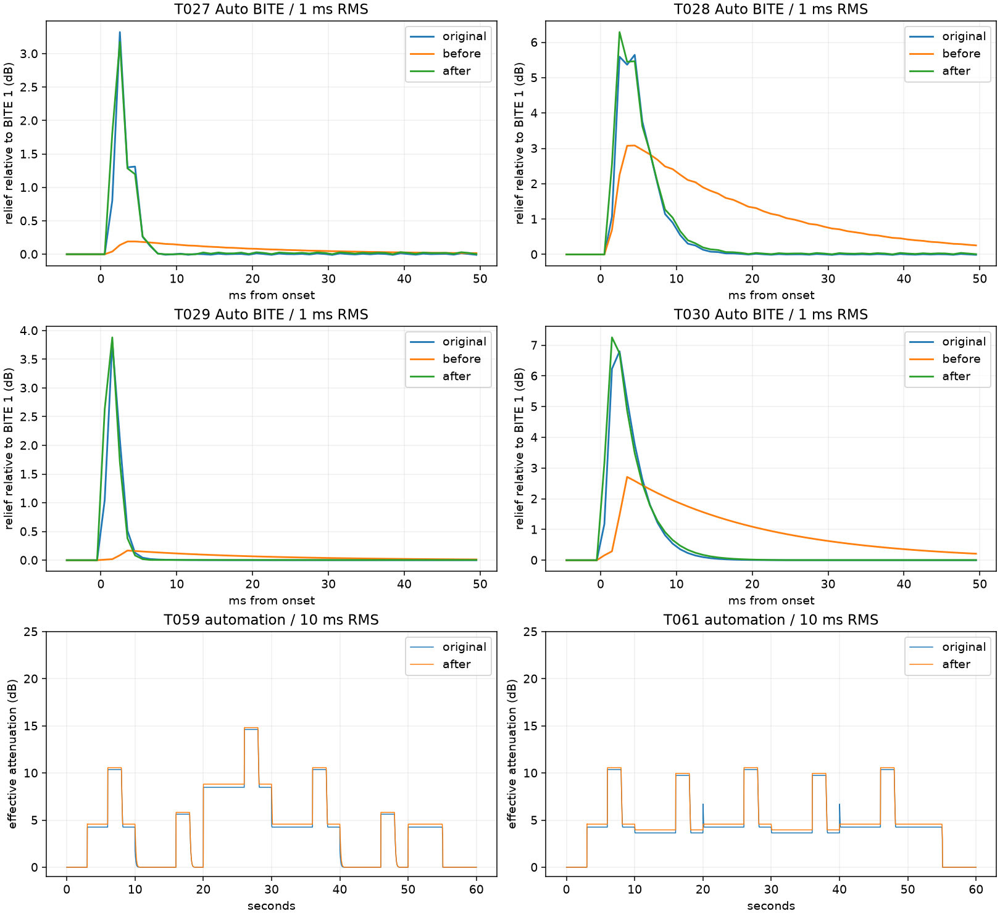

# Render corretti e Auto BITE — 23 settembre 2026

**Implementato Auto BITE nel DSP_MODEL_8, versione di prova 0.2.3.**
La baseline è il commit `4dadce7`, modello 7: la correzione R1 era già
implementata e verificata. Questa revisione modifica il comportamento audio
di Auto con BITE > 1; conserva R1/R2 BITE, rilascio Auto e dinamica GUI.

## Acquisizioni recuperate

I dodici file segnalati sono stati effettivamente sostituiti: T023/T024,
T035–T037 e T055–T061 ora sono udibili, stereo float32 a 48 kHz e **60 s**.
Anche T058 ha la durata corretta. Restano 80 WAV per 75 ID del piano,
includendo cinque vecchie acquisizioni annotate, conservate ma superate dal
nuovo nome esatto `Txxx.wav`. Nessun originale è stato modificato.
[Inventario con hash](inventory.json).

L'utente conferma che T055–T061 seguono **valori e tempi del piano**, non
le variazioni manuali descritte nei vecchi nomi. La misura conferma:

- **T002 = T035 = T036 = T037**, campione per campione: Auto è indipendente
  dai tempi manuali min/max e la ripetizione produce lo stesso risultato.
- **T056 = T057**, campione per campione: anche l'automazione dei tempi
  manuali in Auto non modifica l'audio nelle condizioni acquisite.
- T023 è ora un neutro rumore distinto dal multitono T021.

[Null test riproducibili](original_nulls.json).

I gruppi MC202/MC303 e ALL a 44,1/88,2 kHz precedentemente sospetti **non sono
stati sostituiti**. Rimangono le incongruenze del rapporto del 20 settembre:
T042/T043 identici con banda isolata fortemente attenuata; T041 comprime
principalmente la banda bassa; T063/T071 cambiano praticamente solo LOW;
T022/T067 non sono ripetizioni equivalenti. Sono confronti diagnostici,
non evidenze per correggere il modello. Sidechain T049–T054 e T075–T081
(completamento 96/192 kHz) restano assenti. T087/T088 restano a 96 kHz,
diversi dal piano a 48 kHz; nessun nuovo video in questa consegna.

## Identificazione BITE e modifica

Confrontate quattro ipotesi sui primi 50 ms dell'attacco a 6 s, sui due
segnali isolati 315 Hz/2 kHz: attacco del controllo lineare Auto, attacco
diretto della GR, smussamento della GR normale con un polo oppure due poli.
La prima coppia di ipotesi cambia anche il comportamento del detector a
regime. Il singolo polo applicato alla salita della GR fornisce il compromesso
migliore nelle prove disponibili: RMSE del fit 0,205 dB a BITE 5 e 0,300 dB
a BITE 10; tau identificate circa 0,654 e 2,987 ms.
[Tutte le ipotesi e i risultati](auto_bite_candidate_fit.json).

Il modello implementato usa `tau = 3 ms * ((BITE-1)/9)^1.875`, cioè circa
0,656 ms a BITE 5 e 3 ms a BITE 10. Filtra la salita della GR normale;
se il target scende sotto lo stato corrente lo segue immediatamente.
BITE 1 passa la GR normale esattamente. Il detector Auto e il suo ritorno
102 ms continuano a funzionare; non vengono sostituiti dal filtro BITE.
I coefficienti si aggiornano al cambio BITE/Fs. Reset e cambio modalità
gestiscono lo stato del filtro; i detector BITE manuali rimangono aggiornati.

Questa è un'approssimazione del comportamento misurato, non una ricostruzione
certificata del codice McDSP. I valori intermedi del controllo, altri
ratio/knee e altre sorgenti richiedono ulteriori acquisizioni. Le ripetizioni
nello stesso WAV sono controlli utili, **non sessioni indipendenti**.

## Risultati del motore completo

**73 condizioni renderizzate e confrontate; 69 output identici campione per
campione alla baseline modello 7.** Cambiano soltanto T027–T030, i quattro
casi Auto BITE > 1, e tutti migliorano nella MAE complessiva. Il conteggio
comprende anche i casi diagnostici: non equivale a 73 preset originali
interamente certificati. [Metriche complete](comparison.json),
[casi invariati](unchanged.json), [verifica degli hash](verification.json).

La misura generale usa finestre RMS di 10 ms, ciascun motore diviso per il
proprio neutro B0, escludendo B0 sotto −65 dB in uno dei due motori. È salvata
anche la metrica con attenuazione originale >0,1 dB. Sull'uscita sommata
si misura attenuazione effettiva, non il GR di una singola banda.

Per i transienti si confronta il sollievo BITE rispetto al BITE 1 dello
stesso motore, con RMS di **1 ms**. Esempio dell'attacco a 6 s:

| Caso | Picco originale | Picco prima → dopo | RMSE traiettoria prima → dopo, primi 50 ms |
| --- | ---: | ---: | ---: |
| T027, 315 Hz, BITE 5 | 3,323 dB | 0,191 → 3,176 dB | 0,519 → 0,146 dB |
| T028, 315 Hz, BITE 10 | 5,644 dB | 3,081 → 6,288 dB | 1,187 → 0,239 dB |
| T029, 2 kHz, BITE 5 | 3,801 dB | 0,168 → 3,880 dB | 0,629 → 0,232 dB |
| T030, 2 kHz, BITE 10 | 6,800 dB | 2,711 → 7,252 dB | 1,457 → 0,326 dB |

La RMSE si riduce di circa **63–80%** in queste quattro finestre. Delle 36
finestre di controllo, 20 migliorano e 16 restano invariate; nessuna peggiora.
Dettaglio in [bite_transients.json](bite_transients.json).
La forma temporale migliora oltre al picco: il vecchio sollievo troppo debole
durava troppo a lungo. Restano differenze nei primi campioni e un lieve
eccesso del massimo a BITE 10. A regime sinusoidale il nuovo sollievo residuo
è circa **0,004–0,026 dB**, dovuto alla modulazione del detector; con GR
costante il filtro converge allo stesso valore, come verificato numericamente.

| Caso | MAE complessiva prima → dopo |
| --- | ---: |
| T027 | 0,05678 → 0,05304 dB |
| T028 | 0,05482 → 0,04945 dB |
| T029 | 0,05992 → 0,05872 dB |
| T030 | 0,05966 → 0,05666 dB |

La media su 60 s nasconde la maggior parte del miglioramento sugli attacchi:
per questo vengono conservate entrambe le risoluzioni.



## Nuovi risultati Auto, rumore e automazioni

Il renderer accetta un campo finale opzionale `MANUAL_TIMES`, `MODES`,
`THRESHOLD` o `CROSSOVER`. Divide i blocchi esattamente agli eventi di
10/20/30/40/50 s e applica i parametri a tutte le bande, come nel piano.
Questo è un confronto offline del DSP, non una registrazione del wrapper
e dell'automazione effettiva di Ableton. Nessun riallineamento degli export.

| Caso | MAE complessiva | p95 | Interpretazione |
| --- | ---: | ---: | --- |
| T024, rumore | 0,348 dB | 1,337 dB | Verifica indipendente ora disponibile; resta uno scarto significativo. |
| T035/T036/T037 | 0,0563 dB | 0,3133 dB | Confermate indipendenza dai tempi manuali e ripetizione. |
| T056/T057, Auto statico/tempi manuali | 0,2888 dB | 0,3138 dB | Originali identici; un offset residuo non dipende dall'automazione manuale. |
| T058, cambio modalità | 0,1938 dB | 0,3135 dB | Transizioni ora misurabili; non sono identiche all'originale. |
| T059, threshold | 0,2183 dB | 0,3366 dB | GR segue i cambi previsti, con scarto residuo. |
| T061, crossover | 0,2956 dB | 0,3221 dB | Confrontato con B0 T060 avente la stessa automazione. |

Sul rumore la MAE negli intervalli con attenuazione originale >0,1 dB è
**1,111 dB**: la sola media complessiva sottostima questo limite. La correzione
BITE non cambia questi output, tutti a BITE 1. Non si modifica il detector
generale per compensare una singola sorgente; la differenza merita un'indagine
mirata su risposta ai picchi/rumore, plateau e contributo dei crossover.
[Intervalli delle automazioni](automation_intervals.json).

## Verifica e riproduzione

Suite DSP: aggiunte prove Auto BITE 1/5/10, convergenza, limiti, stato,
reset, prepare a nuovo Fs, cambi BITE/modalità e blocchi 32/512/irregolari.
Copertura numerica a 44,1/48/88,2/96/192 kHz; questa non sostituisce gli
originali nativi ancora mancanti. Conservate le regressioni R1/R2/Auto
e quelle GUI/stato. **CTest Windows Release: 2/2 PASS**, DSP 11,70 s,
GUI 13,96 s, totale 25,74 s. I tempi, rilevati mentre era in corso la
compilazione del VST3, non sono un benchmark CPU. Esiti e hash VST3 in
[build_validation.json](build_validation.json).

Strumenti Windows locali: Visual Studio 2022 Release e Python con
NumPy/SciPy/Matplotlib. Dalla radice del progetto:

```powershell
cmake -S products/MC2000 -B build/MC2000-bite-2026-09-23 -G "Visual Studio 17 2022" -A x64
cmake --build build/MC2000-bite-2026-09-23 --config Release --target MC2000OriginalPackRender MC2000Tests MC2000UITests PonteMC2000_VST3 -j 4
ctest --test-dir build/MC2000-bite-2026-09-23 -C Release --output-on-failure
```

Nella cartella del pack:

```powershell
python fit_auto_bite_2026_09_23.py --build
python analyse_2026_09_23.py --inventory --original
python analyse_2026_09_23.py --prepare before --render before
python analyse_2026_09_23.py --prepare after --render after --measure --details --verify
python record_build_2026_09_23.py
```

La baseline `build/mc2000-corrected-2026-09-23/baseline-model7.exe` è stata
compilata **prima** di modificare il DSP, con il nuovo renderer delle automazioni;
per ricrearla usare Source dal commit 4dadce7 e il renderer di questa revisione.
I 61 output modello 7 già verificati vengono riutilizzati per il confronto
prima; gli altri 12 vengono renderizzati. Il confronto dopo renderizza tutti
i 73 casi. `baseline-Source` conserva i sorgenti, verificati contro gli hash
del rapporto R1. Nessun WAV, array grezzo o binario è incluso nel commit.

## Checklist aggiornata e limiti rimasti

Spuntati inventario, manifest/provenienza, recupero delle automazioni,
separazione audio/video, confronto delle leggi candidate e correzione Auto
BITE. R1 resta spuntato con il suo commit e rapporto precedente. Separate
le acquisizioni mute risolte dai preset incongruenti ancora da chiarire.

Restano aperti: calibrazione Auto su rumore; BITE su altre sorgenti e preset;
gruppi MC202/MC303/ALL sospetti; sidechain; completamento 96/192 kHz;
voce reale e video GR; nap completo; decisione oversampling; benchmark CPU
aggiornato; collaudo DAW e gate finale di release. Non è stata pubblicata
una release né dichiarata completata l'emulazione dell'originale.
