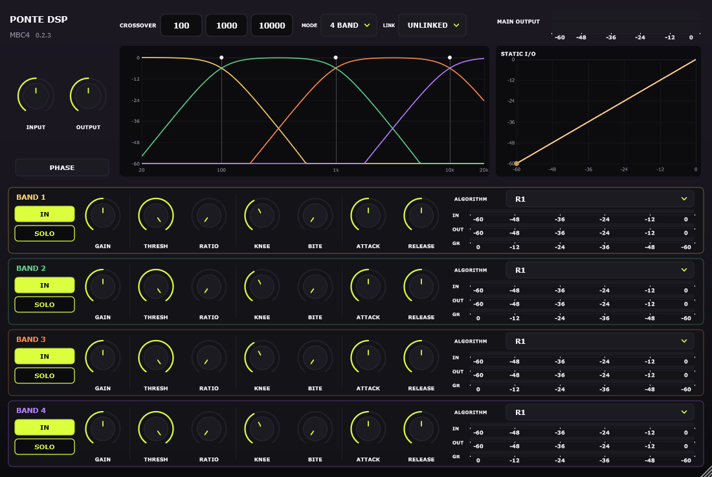

# Build di prova 0.2.3 — interventi indipendenti dai render originali

Base di confronto: release 0.2.2, commit
`f8f2a9c4de1751ba98eb9bac0cefd46d3bc05cea`. Questa build non cambia la legge
Auto, le curve R1/R2/BITE, i crossover, i range dei parametri o DSP_MODEL_5.
La pubblicazione di una nuova release non fa parte di questa task.

## Modifiche

- Ballistics: coefficienti peak/RMS di Auto calcolati in prepare; coefficiente
  d'attacco R1/R2 ricalcolato quando cambia Attack o sample rate.
- BITE: sei coefficienti dipendenti da Fs precalcolati; mappa del controllo
  aggiornata solo quando cambia BITE. Stato e formule restano gli stessi.
- Gain di banda: conversione dB/ampiezza del target una volta per blocco,
  mantenendo lo smoothing per campione.
- Wrapper: ID dei parametri risolti una volta nel costruttore; il callback
  legge direttamente le atomiche APVTS senza costruire stringhe o cercare ID.
  Test dedicati coprono automazione, replaceState e offset dei controlli linked.
- Analizzatore: nessuna scrittura nella FIFO se non esiste un CrossoverPlot.
  Un contatore atomico comunica la presenza del consumer senza usare oggetti
  GUI dal thread audio. Alla riapertura resta lo scarto dei dati pregressi.
- Pesatura FFT: risposta LR4 per bin memorizzata e invalidata al cambio di
  crossover, IN, numero bande o Fs. FFT, risoluzione e ballistics invariate.
- Intestazione: versione derivata da CMake vicino a MBC4. Una release stabile
  successiva appare come `versione installata → nuova versione`, alternando
  grigio e giallo ogni secondo. L'help sostituisce l'intera intestazione.

## Controllo aggiornamenti

Il repository `Ponteh/ponte-mbc4` è pubblico. Il plugin interroga in HTTPS
`https://api.github.com/repos/Ponteh/ponte-mbc4/releases/latest`, senza token,
identificativi utente o dati audio. La richiesta comunica al servizio i normali
dati di una connessione HTTP e uno User-Agent del prodotto.

Il worker è condiviso fra gli header aperti nella stessa istanza caricata del
modulo plugin; il risultato e il limite di un controllo all'ora persistono
alle riaperture nell'host. Richieste e parsing non avvengono nel thread audio,
nel paint o nel timer. Timeout connessione 3 s, lettura limitata a 64 KiB;
chiusura dell'ultimo header cancella la richiesta prima di arrestare il worker.
Offline, HTTP non 200, errori di parsing e rate limit non generano un avviso
falso e non causano retry immediati. Una versione valida già nota resta in cache.

Il confronto numerico accetta tag stabili `vMAJOR.MINOR.PATCH` o senza `v`;
bozze e prerelease sono escluse. Il lampeggio ridisegna soltanto l'header,
si ferma con help visibile o componente non mostrato. Nessuna installazione
automatica. Finché l'ultima release pubblica è 0.2.2, questa build 0.2.3
mostra semplicemente 0.2.3: non ci si aspetta un avviso di aggiornamento.

## Riproducibilità e limiti delle misure

`Research/PerformanceBenchmark.cpp` si compila contro il DSP corrente oppure
una copia congelata di `Source/` della baseline. Le due esecuzioni vanno fatte
in sequenza sulla stessa macchina, senza compilazioni concorrenti.

54 casi: 44.1/48/96 kHz, buffer 64/512/1024, R1/R2/Auto, parametri statici o
automatizzati. I casi comprendono 2/3/4 bande, routing IN/SOLO, stereo e
detector interno/esterno. Una ripetizione di warm-up e cinque misurate per
caso; ogni sorgente dura un secondo. Il timer comprende soltanto process(),
senza allocazioni, generazione sorgente o salvataggio nel tratto misurato.
Per ciascun caso sono registrati durata totale, p99/massimo per blocco e
output stereo float, confrontato con la baseline senza riallineamenti.

Questa è una misura del motore DSP, non della CPU completa di Ableton, del
wrapper o della GUI. Non completa la matrice estesa 192 kHz/mono/allocation
audit della checklist. Cache e FIFO della GUI sono coperte da regressioni
funzionali; non viene dichiarata una percentuale CPU GUI non misurata.

Configurazione aggiuntiva facoltativa per il benchmark baseline:

```powershell
cmake -S products/MC2000 -B build/MC2000-analysis-vs -DMC2000_BASELINE_SOURCE_DIR=C:/percorso/baseline/Source
cmake --build build/MC2000-analysis-vs --config Release --target MC2000Performance MC2000PerformanceBaseline
```

Eseguire i due programmi con cartelle di output distinte, poi:

```powershell
python products/MC2000/Research/compare_performance.py baseline-output current-output comparison.json
```

Il confronto fallisce se anche un solo campione float differisce. I benchmark
temporali restano fuori da CTest, perché i runner condivisi non danno una
baseline prestazionale stabile. `MC2000UpdateProbe` è una verifica manuale
del worker HTTP reale; le suite automatiche usano dati simulati senza rete.

## Attività ancora aperte

I nuovi export restano necessari per identificare e correggere Auto e per
chiudere la recensione. Il nap completo può essere sviluppato localmente,
ma richiede la sua macchina a stati e i test di drenaggio/risveglio: **non è
implementato da questa ottimizzazione della FIFO**. L'oversampling richiede
prima lo studio aliasing/qualità/costo; quel primo studio può essere fatto
con stimoli locali, senza attendere tutti i render McDSP.

Restano anche il benchmark del wrapper/GUI, l'audit completo allocazioni e
le prove DAW. La checklist conserva queste attività aperte.

## Risultati del confronto, completato il 2026-09-19

**54/54 output bit-identici** alla baseline: errore massimo fra campioni float
uguale a zero in tutti i casi, comprese le automazioni. Il confronto riguarda
queste sorgenti e configurazioni, non una dimostrazione per ogni input possibile.

| Misura DSP process() | Risultato |
| --- | ---: |
| Riduzione mediana del tempo totale fra i 54 casi | 53.79% |
| Mediana R1 | 56.18% |
| Mediana R2 | 45.87% |
| Mediana Auto | 54.81% |
| Intervallo dei risparmi fra casi | -1.26% .. 72.10% |
| Casi con regressione del p99 superiore al 5% | 0 |

Il caso peggiore sul tempo totale è circa 1.26% più lento; non si dichiara
un'accelerazione uniforme. La misura esclude wrapper, interfaccia e rete.
Macchina: Windows 10 build 19045, Intel Family 6 Model 58 Stepping 9; Release
MSVC x64, stessa configurazione per entrambe le build, esecuzioni in sequenza.
I valori non sono una previsione della percentuale CPU mostrata da una DAW.

[Dati per caso e hash degli output/baseline](performance_2026-09-18.json).


Verifica HTTP reale: `MC2000UpdateProbe` ha letto correttamente **0.2.2** dal
repository pubblico. I test automatici restano indipendenti dalla rete.


Verifica finale locale: **CTest 2/2 PASS**, DSP 3.29 s, GUI 4.70 s (8.74 s
complessivi). Inclusi automazione/ripristino preset/link con puntatori APVTS
in cache, FIFO senza editor, audio identico con/senza analizzatore, versioni
numeriche e help che nasconde l'avviso. Risolta un'incoerenza degli oggetti
incrementali ricompilando insieme wrapper, editor e test dopo il cambio header.


